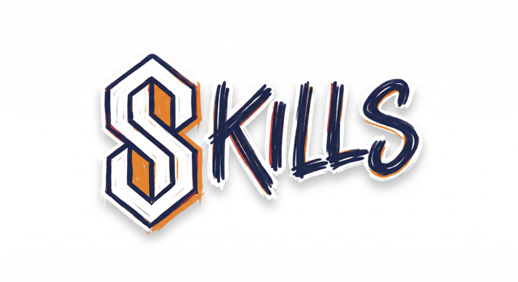

<p align="center">
  
</p>

# Skills

Practical agent skills for planning, building, and shipping software.

## Quickstart

```bash
npx skills add adriancodes/skills
```

Choose the skills you want during installation. Each works independently in any harness supported by the [skills CLI](https://github.com/vercel-labs/skills).

## Which skill, when

| You're about to… | Reach for |
|------------------|-----------|
| Build from a plan that "feels settled" | [`create-spec`](skills/create-spec/SKILL.md) — it usually isn't |
| Write down a design you already discussed | [`create-spec`](skills/create-spec/SKILL.md) — capture mode, zero questions |
| Turn a confirmed spec into work items | [`create-tasks`](skills/create-tasks/SKILL.md) |
| Build the next task | [`implement-task`](skills/implement-task/SKILL.md) |
| Build or fix behavior test-first | [`tdd`](skills/tdd/SKILL.md) |
| Take a feature end-to-end (or resume one) | [`deliver-feature`](skills/deliver-feature/SKILL.md) |
| Run an agent on a schedule, safely | [`build-loop`](skills/build-loop/SKILL.md) |
| Understand an unfamiliar repository | [`understand-codebase`](skills/understand-codebase/SKILL.md) |
| Diagnose a bug, flake, or regression | [`diagnose`](skills/diagnose/SKILL.md) |
| Review a branch, PR, or work-in-progress diff | [`code-review`](skills/code-review/SKILL.md) |
| Apply maintainability and design guidance | [`engineering-best-practices`](skills/engineering-best-practices/SKILL.md) |
| Remove unnecessary code or abstractions | [`simplify-code`](skills/simplify-code/SKILL.md) |
| Ship a script, config, or skill | [`verify-work`](skills/verify-work/SKILL.md) |
| Write or fix an agent skill | [`create-skill`](skills/create-skill/SKILL.md) |
| Sharpen a vague ask before running it | [`improve-prompt`](skills/improve-prompt/SKILL.md) |
| Get short plain answers, not essays | [`be-concise`](skills/be-concise/SKILL.md) |
| Everything, all session long | [`work-discipline`](work-discipline/work-discipline.md) (always-on layer) |
| Ask a quick factual question | No skill — just ask |

Five skills form an optional pipeline: `create-spec` → `create-tasks` → `implement-task` → `verify-work`, coordinated by `deliver-feature`. They hand work between sessions and teammates through files in `docs/specs/`. Each skill also works independently.

## Work Discipline

[`work-discipline`](work-discipline/work-discipline.md) is an optional always-on behavior layer, not an installable skill. Copy it into Claude Code as an output style:

```bash
mkdir -p ~/.claude/output-styles
cp work-discipline/work-discipline.md ~/.claude/output-styles/
```

For other agents, add its contents to the agent's project instructions.

## Verify your install

Model-invoked skills can fail silently when their triggers do not fire. These checks cover the main workflows:

- **create-spec** — say *"stress-test my plan to add search to the app."* Pass: exactly one question arrives, with a recommended answer, and `docs/specs/<date>-*.md` appears. Fail: a batch of questions, or code.
- **verify-work** — point at any small script and say *"is this ready to ship?"* Pass: fixture files get written and executed. Fail: a verdict from reading the code.
- **work-discipline** — give it an ambiguous task. Pass: it offers compact numbered options, recommends a sensible default, and allows a custom answer. Fail: it guesses or starts work without approval.

## For teams

The planning and delivery skills write shared artifacts into your repository so work can survive the session that created it:

- `docs/specs/` — one decision log per spec session, read back and confirmed before building
- `CONTEXT.md` — glossary entries captured when terminology needs clarification
- `docs/adr/` — optional records for consequential architecture decisions

Everyone on the team runs the same install; the artifacts become the team's paper trail.

**Pin your version.** A skill update changes your whole team's agent behavior — treat it like a dependency upgrade. Pin to a commit or tag and read the [CHANGELOG](CHANGELOG.md) before moving.

## License

MIT — see [LICENSE](LICENSE). Every SKILL.md also carries `license: MIT` in its frontmatter, so a cherry-picked skill travels with its terms.

## Acknowledgements

Shout-out to [Matt Pocock's skills collection](https://github.com/mattpocock/skills), [Ponytail](https://github.com/DietrichGebert/ponytail), and [Caveman](https://github.com/JuliusBrussee/caveman). Their approaches to practical engineering workflows, simpler code, and concise agent communication helped inspire this collection.
