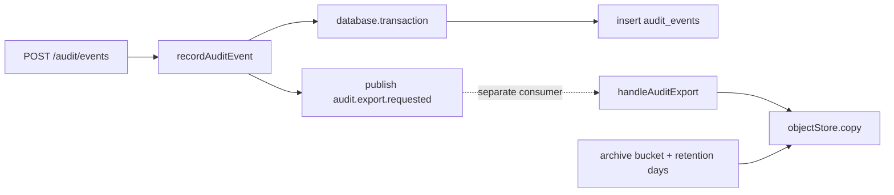

I’m using the supplied understand-codebase workflow because this is change preparation: I’ll trace only the current audit-event path and keep the workspace untouched.

The main seam is clear: the HTTP handler calls a service that commits persistence before publishing a job; a separate worker performs archive export. I’m checking the full test/config surface now, especially whether retention and ordering are actually asserted or only documented.

An audit event follows this path:

ASCII fallback: `HTTP → service → transaction/insert → queue → worker → archive`

### Code path

1. **HTTP entry**

   `handleRequest` routes any `/audit...` URL to `handleAuditRequest` ([server.ts](/var/folders/tt/fpnrgdcj5zgfw5ytq9qsq7f80000gn/T/understand-codebase-heldout-audit-export-skill-work-KAxzeL/src/server.ts:4)). The audit router accepts only `POST /audit/events`, parses the JSON body, and calls `recordAuditEvent` ([router.ts](/var/folders/tt/fpnrgdcj5zgfw5ytq9qsq7f80000gn/T/understand-codebase-heldout-audit-export-skill-work-KAxzeL/src/audit/router.ts:3)). After the service completes, it returns `202` with the generated event ID.

2. **Validation and event creation**

   `recordAuditEvent` rejects null and non-object inputs, then adds a UUID and ISO timestamp to the submitted payload ([service.ts](/var/folders/tt/fpnrgdcj5zgfw5ytq9qsq7f80000gn/T/understand-codebase-heldout-audit-export-skill-work-KAxzeL/src/audit/service.ts:5)).

3. **Transaction boundary**

   The transaction contains exactly one operation: `insertAuditEvent(tx, event)` ([service.ts](/var/folders/tt/fpnrgdcj5zgfw5ytq9qsq7f80000gn/T/understand-codebase-heldout-audit-export-skill-work-KAxzeL/src/audit/service.ts:8)). The repository inserts the complete event into the `audit_events` table ([repository.ts](/var/folders/tt/fpnrgdcj5zgfw5ytq9qsq7f80000gn/T/understand-codebase-heldout-audit-export-skill-work-KAxzeL/src/audit/repository.ts:3)).

   The queue publication is **outside** that transaction and occurs only after `database.transaction(...)` resolves. Consequently, persistence and job publication are not atomic: a successful commit followed by a publication failure can leave an event without export work.

4. **Asynchronous handoff**

   `enqueueAuditExport` publishes `{ eventId }` under the topic `audit.export.requested` ([queue.ts](/var/folders/tt/fpnrgdcj5zgfw5ytq9qsq7f80000gn/T/understand-codebase-heldout-audit-export-skill-work-KAxzeL/src/export/queue.ts:3)). The HTTP path does not invoke the export worker directly.

   A separate consumer is expected to deliver that job to `handleAuditExport`, which forwards the event ID to `archiveAuditEvent` ([worker.ts](/var/folders/tt/fpnrgdcj5zgfw5ytq9qsq7f80000gn/T/understand-codebase-heldout-audit-export-skill-work-KAxzeL/src/export/worker.ts:3)).

5. **Export and retention**

   The sink copies `audit-events/<eventId>.json` into the configured archive bucket and supplies `expiresInDays` to the object store ([sink.ts](/var/folders/tt/fpnrgdcj5zgfw5ytq9qsq7f80000gn/T/understand-codebase-heldout-audit-export-skill-work-KAxzeL/src/export/sink.ts:3)).

   Configuration is read at module initialization:

   - Bucket: `AUDIT_ARCHIVE_BUCKET`, defaulting to `audit-dev`
   - Retention: numeric `AUDIT_RETENTION_DAYS`, defaulting to `30`

   Both are defined in [config.ts](/var/folders/tt/fpnrgdcj5zgfw5ytq9qsq7f80000gn/T/understand-codebase-heldout-audit-export-skill-work-KAxzeL/src/config.ts:1).

### Test evidence and limits

The only audit-flow test calls `recordAuditEvent`, checks that an ID exists, and then manually invokes the worker ([audit-flow.test.ts](/var/folders/tt/fpnrgdcj5zgfw5ytq9qsq7f80000gn/T/understand-codebase-heldout-audit-export-skill-work-KAxzeL/tests/audit-flow.test.ts:4)). Its comment confirms that the worker is intended as a separate consumer.

Confirmed from code:

- The insert is awaited before queue publication.
- Publication is outside the database transaction.
- Export retention is passed as `expiresInDays`.
- The worker is separate from the HTTP call path.

Not substantiated by tests or visible wiring:

- The test name claims persistence-before-publication, but it does not spy on or assert call ordering.
- No test exercises the HTTP route or `202` response.
- No test asserts the queue topic or job body.
- No test verifies bucket selection, the 30-day default, environment overrides, or invalid retention values.
- Consumer registration, retry/delivery semantics, and queue durability are not present.
- The visible code does not show how the source object `audit-events/<id>.json` is created from the database row.
- The database adapter is a non-persisting fixture, and the repository is explicitly described as intentionally non-runnable ([README.md](/var/folders/tt/fpnrgdcj5zgfw5ytq9qsq7f80000gn/T/understand-codebase-heldout-audit-export-skill-work-KAxzeL/README.md:1)). Thus actual commit, rollback, and export behavior remain unknown beyond the documented call structure.
