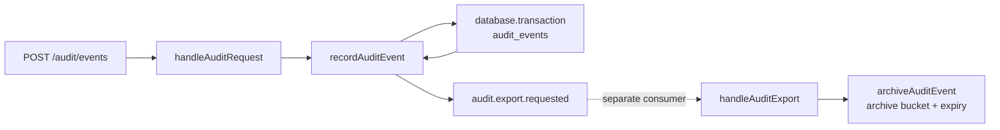

I’m using the supplied understand-codebase workflow to trace this as change preparation. I’ll stay read-only and anchor each transition, transaction, async boundary, retention setting, and test in inspected symbols.

An audit event is validated and persisted during the HTTP request, then an export job is published only after the database transaction returns. A separate worker copies the event’s JSON object into an archive bucket, applying retention as the archive object’s expiration period.

ASCII fallback: `HTTP → router → service → transaction/insert → queue ··· worker → archive object with expiry`

### Request and persistence path

1. `handleRequest` ([src/server.ts:4](/private/var/folders/tt/fpnrgdcj5zgfw5ytq9qsq7f80000gn/T/understand-codebase-heldout-audit-export-skill-work-VCbRmx/src/server.ts:4)) → `handleAuditRequest` ([src/audit/router.ts:3](/private/var/folders/tt/fpnrgdcj5zgfw5ytq9qsq7f80000gn/T/understand-codebase-heldout-audit-export-skill-work-VCbRmx/src/audit/router.ts:3)) when the path begins with `/audit`.

2. `handleAuditRequest` accepts exactly `POST /audit/events`, parses the JSON body, and calls `recordAuditEvent` ([src/audit/router.ts:5](/private/var/folders/tt/fpnrgdcj5zgfw5ytq9qsq7f80000gn/T/understand-codebase-heldout-audit-export-skill-work-VCbRmx/src/audit/router.ts:5)).

3. `recordAuditEvent` ([src/audit/service.ts:5](/private/var/folders/tt/fpnrgdcj5zgfw5ytq9qsq7f80000gn/T/understand-codebase-heldout-audit-export-skill-work-VCbRmx/src/audit/service.ts:5)) performs minimal validation—the body must be a non-null object—then adds a UUID and ISO timestamp.

4. `recordAuditEvent` → `database.transaction` ([src/audit/service.ts:8](/private/var/folders/tt/fpnrgdcj5zgfw5ytq9qsq7f80000gn/T/understand-codebase-heldout-audit-export-skill-work-VCbRmx/src/audit/service.ts:8)) → `insertAuditEvent` ([src/audit/repository.ts:3](/private/var/folders/tt/fpnrgdcj5zgfw5ytq9qsq7f80000gn/T/understand-codebase-heldout-audit-export-skill-work-VCbRmx/src/audit/repository.ts:3)) → `tx.insert("audit_events", event)`.

The transaction contains only the database insert. Queue publication is outside its callback and occurs after the awaited transaction returns. The fixture’s database adapter merely invokes the callback with a no-op `insert`, so real commit/rollback behavior is not represented ([src/storage/database.ts:3](/private/var/folders/tt/fpnrgdcj5zgfw5ytq9qsq7f80000gn/T/understand-codebase-heldout-audit-export-skill-work-VCbRmx/src/storage/database.ts:3)).

### Asynchronous handoff and export

After persistence:

- `recordAuditEvent` → `enqueueAuditExport` ([src/audit/service.ts:9](/private/var/folders/tt/fpnrgdcj5zgfw5ytq9qsq7f80000gn/T/understand-codebase-heldout-audit-export-skill-work-VCbRmx/src/audit/service.ts:9)).
- `enqueueAuditExport` publishes `{ eventId }` under `audit.export.requested` ([src/export/queue.ts:3](/private/var/folders/tt/fpnrgdcj5zgfw5ytq9qsq7f80000gn/T/understand-codebase-heldout-audit-export-skill-work-VCbRmx/src/export/queue.ts:3)).
- A separate consumer invokes `handleAuditExport` ([src/export/worker.ts:3](/private/var/folders/tt/fpnrgdcj5zgfw5ytq9qsq7f80000gn/T/understand-codebase-heldout-audit-export-skill-work-VCbRmx/src/export/worker.ts:3)).
- `handleAuditExport` → `archiveAuditEvent`, which copies `audit-events/{eventId}.json` into the configured archive bucket ([src/export/sink.ts:3](/private/var/folders/tt/fpnrgdcj5zgfw5ytq9qsq7f80000gn/T/understand-codebase-heldout-audit-export-skill-work-VCbRmx/src/export/sink.ts:3)).

The HTTP path awaits successful queue publication, but not worker execution. It then returns `202` with the generated `eventId` ([src/audit/router.ts:8](/private/var/folders/tt/fpnrgdcj5zgfw5ytq9qsq7f80000gn/T/understand-codebase-heldout-audit-export-skill-work-VCbRmx/src/audit/router.ts:8)).

### Retention configuration

`auditConfig` reads:

- Archive bucket: `AUDIT_ARCHIVE_BUCKET`, defaulting to `audit-dev`.
- Retention: `AUDIT_RETENTION_DAYS`, converted with `Number(...)`, defaulting to `30`.

Both are defined in `auditConfig` ([src/config.ts:1](/private/var/folders/tt/fpnrgdcj5zgfw5ytq9qsq7f80000gn/T/understand-codebase-heldout-audit-export-skill-work-VCbRmx/src/config.ts:1)). `archiveAuditEvent` passes `retentionDays` as `expiresInDays` on the object-store copy.

Thus, the existing retention control applies to the exported archive object. No inspected code applies retention to the `audit_events` database row.

### Test evidence

The sole audit-flow test, `persists before publishing export work` ([tests/audit-flow.test.ts:4](/private/var/folders/tt/fpnrgdcj5zgfw5ytq9qsq7f80000gn/T/understand-codebase-heldout-audit-export-skill-work-VCbRmx/tests/audit-flow.test.ts:4)), calls `recordAuditEvent`, checks that an ID exists, and then manually invokes `handleAuditExport`. Its comment explicitly documents the worker as a separate consumer.

However, it does not spy on transaction, insert, publication, or object-store calls. Consequently, its name and sequencing document the intended flow, but it does not independently assert:

- insert-before-publish ordering;
- rollback or commit behavior;
- the HTTP route and `202` response;
- queue delivery semantics;
- archive bucket or retention values;
- export retries, failures, or idempotency.

### Confirmed, inferred, and unknown

Confirmed:

- Persistence is inside the transaction callback.
- Publication follows the awaited transaction.
- Worker processing is separate from the HTTP path.
- Export expiration comes from `AUDIT_RETENTION_DAYS`, defaulting to 30 days.
- The HTTP response waits for publication but not export completion.

Consequential inference:

- Returning from `database.transaction` represents the commit boundary intended by `recordAuditEvent`; the synthetic adapter has no actual commit implementation.

Unknown from this repository:

- How `audit-events/{eventId}.json` is created before the archive copy—the persistence path only shows a database insert.
- Queue durability, delivery guarantees, retries, and consumer registration.
- Actual database transaction semantics.
- Object-store expiration behavior and whether database records are ever purged.
- Validation of invalid, negative, fractional, or nonnumeric retention settings.
