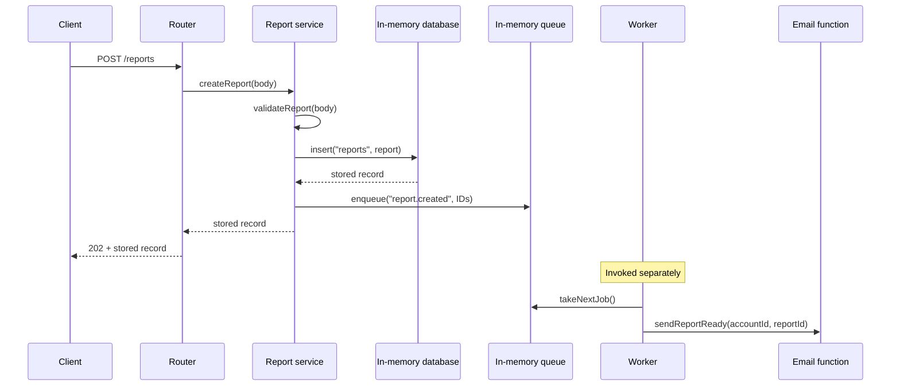

I’ll trace report creation from its entry point through persistence/response handling, then follow any post-response work into the focused tests. I’ll keep the exploration limited to that flow and its direct configuration/dependencies.

The request path is deliberately small: the API validates and stores the report, then enqueues follow-up work before returning a `202`. I’m now checking the queue/worker boundary carefully, because that determines what truly happens “after the response” versus merely after persistence.

Report creation is a two-stage flow:

1. `POST /reports` validates and stores the report, queues a `report.created` job, and only then returns `202`.
2. Separately, a worker can consume that job and call the “report ready” email function.

A key onboarding detail: the enqueue happens before the response, not after it. What is intended to happen asynchronously after the response is job processing—but this fixture contains no scheduler or automatic worker startup. `runOneJob()` must be invoked separately.



Text fallback: `POST /reports → validate → insert → enqueue → 202 response`; later, an independently invoked worker does `dequeue → sendReportReady`.

### Relevant code path

1. Server boundary

`startServer()` exposes the router as its `handle` function. It does not start a worker or HTTP framework itself: [src/server.ts:3](/private/var/folders/tt/fpnrgdcj5zgfw5ytq9qsq7f80000gn/T/understand-codebase-prompt-work-7Gyppz/src/server.ts:3).

2. Request routing

`handleRequest()` recognizes only `POST /reports`, delegates to `createReport()`, waits for it to finish, and returns the resulting record with status `202`: [src/http/router.ts:3](/private/var/folders/tt/fpnrgdcj5zgfw5ytq9qsq7f80000gn/T/understand-codebase-prompt-work-7Gyppz/src/http/router.ts:3).

Because it awaits `createReport()`, validation, insertion, and enqueueing must all complete before the caller receives the response.

3. Report orchestration

`createReport()` owns the central workflow: [src/reports/service.ts:6](/private/var/folders/tt/fpnrgdcj5zgfw5ytq9qsq7f80000gn/T/understand-codebase-prompt-work-7Gyppz/src/reports/service.ts:6).

- `validateReport()` requires a truthy `accountId` and `title`: [src/reports/service.ts:13](/private/var/folders/tt/fpnrgdcj5zgfw5ytq9qsq7f80000gn/T/understand-codebase-prompt-work-7Gyppz/src/reports/service.ts:13).
- `insertReport()` stores the validated values: [src/reports/repository.ts:3](/private/var/folders/tt/fpnrgdcj5zgfw5ytq9qsq7f80000gn/T/understand-codebase-prompt-work-7Gyppz/src/reports/repository.ts:3).
- It queues `report.created` with only `reportId` and `accountId`, then returns the stored record: [src/reports/service.ts:8](/private/var/folders/tt/fpnrgdcj5zgfw5ytq9qsq7f80000gn/T/understand-codebase-prompt-work-7Gyppz/src/reports/service.ts:8).

4. Persistence

The “database” is an in-memory object. Its `insert()` assigns a process-local incrementing ID and returns:

```ts
{ id, table: "reports", accountId, title }
```

See [src/storage/database.ts:1](/private/var/folders/tt/fpnrgdcj5zgfw5ytq9qsq7f80000gn/T/understand-codebase-prompt-work-7Gyppz/src/storage/database.ts:1). Nothing is persisted across process restarts.

5. Queued work

The queue is also an in-memory array. `enqueue()` appends a job; `takeNextJob()` removes the oldest job with `shift()`: [src/jobs/queue.ts:3](/private/var/folders/tt/fpnrgdcj5zgfw5ytq9qsq7f80000gn/T/understand-codebase-prompt-work-7Gyppz/src/jobs/queue.ts:3).

`runOneJob()` consumes one job. For `report.created`, it converts the payload identifiers to strings and awaits `sendReportReady()`: [src/worker.ts:4](/private/var/folders/tt/fpnrgdcj5zgfw5ytq9qsq7f80000gn/T/understand-codebase-prompt-work-7Gyppz/src/worker.ts:4).

The email function is a stub: it returns a `{ delivered: true, accountId, reportId }` object but performs no external delivery: [src/notifications/email.ts:1](/private/var/folders/tt/fpnrgdcj5zgfw5ytq9qsq7f80000gn/T/understand-codebase-prompt-work-7Gyppz/src/notifications/email.ts:1).

### Where it is tested

Both stages appear in [tests/report-flow.test.ts:4](/private/var/folders/tt/fpnrgdcj5zgfw5ytq9qsq7f80000gn/T/understand-codebase-prompt-work-7Gyppz/tests/report-flow.test.ts:4):

- The first test calls the router and confirms a `202` response containing the submitted `accountId` and `title`.
- The second creates a report, invokes `runOneJob()`, and checks only that processing resolves without throwing: [tests/report-flow.test.ts:14](/private/var/folders/tt/fpnrgdcj5zgfw5ytq9qsq7f80000gn/T/understand-codebase-prompt-work-7Gyppz/tests/report-flow.test.ts:14).

### Confirmed facts

- Storage and queueing finish before the response.
- Job processing is separate from request handling.
- Reports, jobs, and IDs exist only in memory.
- The notification implementation is a stub.
- The tests exercise the request and worker entry points, but do not inspect the queued payload or resulting notification.

### Inference

The `202` and queue boundary express an asynchronous design: accepting a report is the synchronous responsibility, while notification is intended as deferred work. This is architectural intent inferred from the status code and separation; no actual background runtime is present.

### Unknowns

- What invokes `runOneJob()` in a deployed system.
- How errors should map to HTTP responses.
- What should happen if enqueueing or notification fails.
- Whether report creation involves any processing beyond sending a notification in the real application.
- The repository has no package/test-runner configuration, so the executable test command is not defined here.
